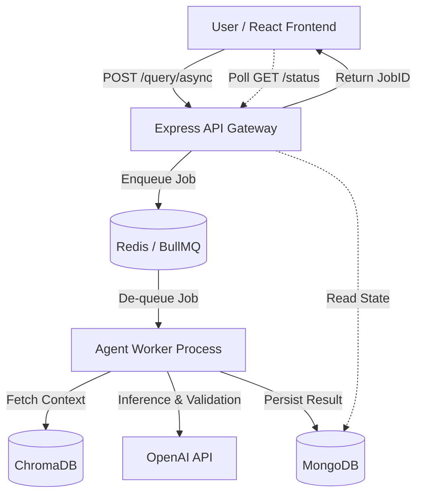
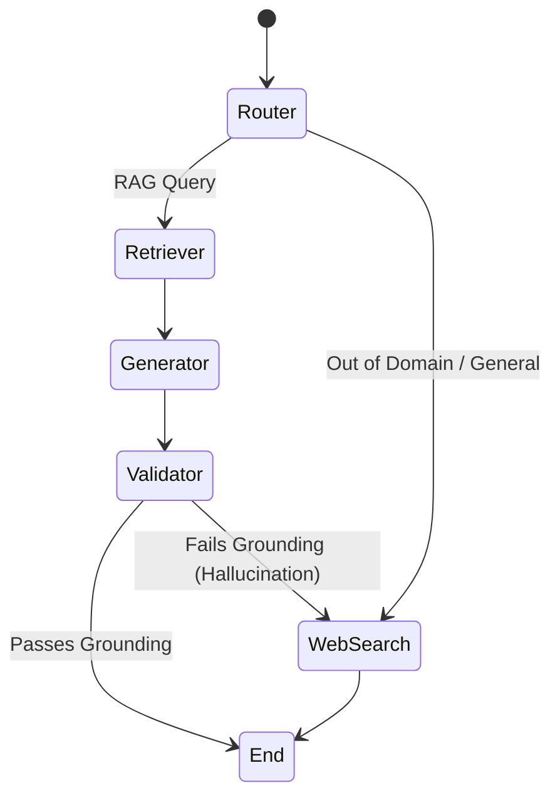
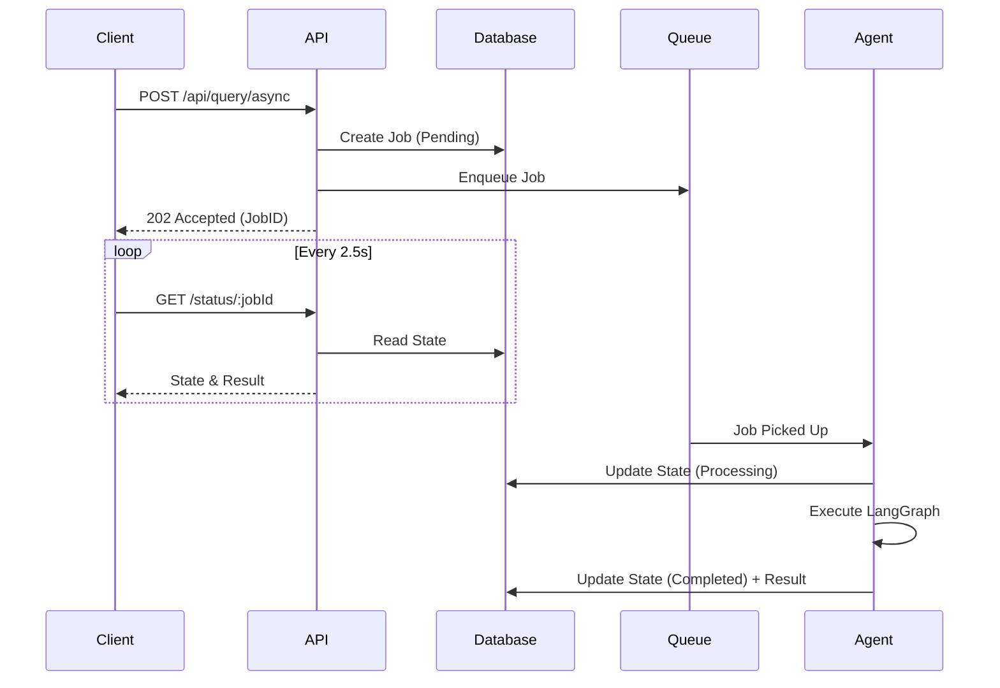
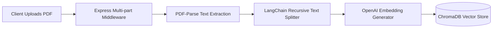
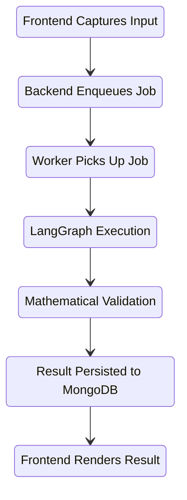

# VeriRAG: RAG Hallucination Firewall — Agentic Edition


## 1. Project Overview

**VeriRAG** is an enterprise-grade AI infrastructure project designed to eliminate Large Language Model (LLM) hallucinations in Retrieval-Augmented Generation (RAG) pipelines. Rather than relying on simple semantic similarity, VeriRAG orchestrates an advanced, multi-step validation agent using **LangGraph**. 

This system forces the AI to explicitly ground every factual claim in the retrieved context. If a generated answer lacks strong mathematical vector similarity to the source document, or if the Validator agent detects semantic drift, the system actively intercepts the response, scores the hallucination risk, and (optionally) routes the query to a web search fallback. 

Built with scalability in mind, the architecture decouples synchronous API requests from heavy LLM inferences via an asynchronous **BullMQ / Redis** pipeline.

---

## 2. Key Features

- **Agentic Routing & Validation (LangGraph)**: Multi-node state machine that dynamically routes queries between Vector DB retrieval, Generation, and strict Validation nodes.
- **Mathematical Hallucination Scoring**: Computes a deterministic confidence score based on maximum and average cosine similarity between the generated response and source contexts.
- **Asynchronous Execution (BullMQ)**: Prevents HTTP timeout exhaustion by offloading heavy LLM inference chains to a Redis-backed queue.
- **Enterprise Observability**: Winston JSON structured logging, execution duration telemetry, correlation IDs, and robust graceful shutdown sequences.

- **Warm Minimalism Frontend**: A premium, "Parchment & Ink" React dashboard for real-time trace visualization and PDF ingestion.

---

## 3. Tech Stack

| Domain | Technologies |
| :--- | :--- |
| **Core AI Orchestration** | LangGraph, LangChain, Google Gemini (LangChain, gemini-1.5-flash, text-embedding-004) |
| **Backend API** | Node.js, Express, Zod |
| **Queue & Cache** | BullMQ, Redis |
| **Vector Database** | ChromaDB, text-embedding-3-small |
| **Persistence** | MongoDB |
| **Frontend** | React (Vite), Axios, Custom Context Providers |
| **Observability** | Winston, Datadog-ready JSON logs |

---

## 4. System Architecture

VeriRAG utilizes an event-driven, decoupled microservices pattern to ensure high availability during expensive LLM inference cycles.



---

## 5. LangGraph Workflow

The core of VeriRAG is a stateful agent graph. Instead of a single zero-shot prompt, the query passes through specialized nodes.



---

## 6. Hallucination Detection Logic

VeriRAG does not rely solely on "LLM-as-a-judge" for validation. It employs a mathematical vector grounding strategy.

### The Algorithm
When the `Generator` node creates an answer, the `Validator` node embeds that answer into a vector. It then calculates the Cosine Similarity between the Answer Vector and the original Document Context Vectors.

```javascript
score = (maxSim * 0.7) + (avgSim * 0.3)
```

- **`maxSim`**: Ensures at least one source document highly correlates with the answer (preventing total fabrications). Weighted heavily (70%).
- **`avgSim`**: Ensures the answer doesn't drift too far from the overall context. Weighted moderately (30%).

**Routing Logic**:
- If `score > 0.75` and `flagged === false`: Answer is returned to the user.
- If `score < 0.75`: The system detects a hallucination, halts the response, and falls back to a web search or returns a safety warning.

---

## 7. Async BullMQ Pipeline

Synchronous HTTP requests are fundamentally incompatible with complex, multi-step LLM agent chains which may take 5–20 seconds to execute. VeriRAG solves this using a robust background queue.



---

## 8. PDF Ingestion Pipeline

To support custom knowledge bases, the ingestion pipeline processes and chunks large PDF files efficiently.



---

## 9. Query Lifecycle

This diagram demonstrates the end-to-end journey of a single user prompt from the React UI to the final mathematical validation.



---


## 11. Frontend Architecture

The frontend is a Vite-powered React application styled with a strict "Warm Minimalism" design system (Parchment & Ink aesthetic).

- **Resilience**: Features a global `ErrorBoundary` to catch React tree crashes and a custom `ToastProvider` for sliding notifications.
- **Optimistic UI**: Chat bubbles appear instantly.
- **Telemetry**: The UI continuously polls the backend, rendering a live SVG representation of the LangGraph execution trace (Router → Retriever → Generator → Validator).
- **Graceful Degradation**: If a job stalls or times out (90s), the UI seamlessly presents a "Retry" mechanism.

---

## 12. API Documentation

### Core Endpoints

| Method | Endpoint | Description |
| :--- | :--- | :--- |
| `GET` | `/api/health` | Deep health check (pings Mongo, Redis). |
| `POST` | `/api/ingest/pdf` | Uploads a PDF (multipart/form-data), chunks, embeds, and indexes to ChromaDB. |
| `POST` | `/api/query/async` | Enqueues a query to the BullMQ pipeline. Returns a `jobId`. |
| `GET` | `/api/query/status/:id`| Polls the status and payload of a specific job. |
| `GET` | `/api/query/history` | Paginated retrieval of past queries. |

---

## 13. Folder Structure

```text
VeriRAG/
├── backend/
│   ├── src/
│   │   ├── agent/        # LangGraph logic, nodes, and state schema
│   │   ├── api/          # Express routes, Zod validation, Controllers
│   │   ├── config/       # MongoDB, ChromaDB, Env configs
│   │   ├── ingestion/    # PDF parsing, LangChain TextSplitters
│   │   ├── middleware/   # Request correlation, Error Handlers
│   │   ├── models/       # Mongoose schemas
│   │   ├── queue/        # BullMQ Worker, Producer, Redis Connection

│   │   ├── utils/        # Winston Logger, AsyncHandlers
│   │   └── server.js     # Entry point, Graceful Shutdown
│   ├── Dockerfile
│   └── docker-compose.yml
└── frontend/
    ├── src/
    │   ├── api.js        # Axios singleton and endpoints
    │   ├── components/   # Sidebar, Toasts, Error Boundaries
    │   ├── pages/        # Chat, Dashboard, Documents, History, Settings
    │   ├── App.jsx       # Layout and Routing
    │   └── index.css     # Design Tokens (Warm Minimalism)
    └── vite.config.js
```

---

## 14. Setup Instructions

### Prerequisites
- Node.js v20+
- Docker & Docker Compose
- OpenAI API Key

### Installation

1. **Clone & Install**
   ```bash
   git clone <repo>
   cd VeriRAG
   cd backend && npm install
   cd ../frontend && npm install
   ```

2. **Start Infrastructure (Redis, ChromaDB)**
   ```bash
   cd backend
   docker-compose up -d
   ```

3. **Start the Backend**
   ```bash
   npm run dev
   ```

4. **Start the Frontend**
   ```bash
   cd ../frontend
   npm run dev
   ```

---

## 15. Docker Setup

The backend includes a `docker-compose.yml` to orchestrate infrastructure easily.

```yaml
version: '3.8'
services:
  redis:
    image: redis:7-alpine
    ports: ["6379:6379"]
  chromadb:
    image: chromadb/chroma:latest
    ports: ["8000:8000"]
    volumes: ["chroma-data:/chroma/chroma"]
```

---

## 16. Environment Variables

Create a `.env` in the `/backend` directory:

```env
PORT=8080
OPENAI_API_KEY=sk-proj-...
MONGO_URI=mongodb://localhost:27017/verirag
REDIS_HOST=127.0.0.1
REDIS_PORT=6379
CHROMA_URL=http://localhost:8000
LOG_LEVEL=info
```

---

## 17. Deployment Instructions

1. **Database**: Provision MongoDB Atlas and a managed Redis instance (e.g., Upstash or AWS ElastiCache).
2. **Backend**: Deploy the Node.js application to a container orchestration platform (e.g., AWS ECS, Google Cloud Run, or Render). Set `WORKER_CONCURRENCY` based on CPU limits.
3. **Frontend**: Build the React app (`npm run build`) and deploy the static assets to Vercel, Netlify, or AWS S3 + CloudFront.

---

## 18. Example Screenshots

*(Insert Screenshots Here)*

- ``
- ``
- ``

---

## 19. Future Improvements

- **Streaming Responses**: Refactor the BullMQ pipeline into a WebSocket/SSE connection to stream LLM tokens directly to the frontend in real-time.
- **RBAC**: Implement JSON Web Tokens (JWT) and Role-Based Access Control to isolate query histories per user.
- **Advanced Graph Memory**: Integrate LangGraph's `checkpointer` (via Redis) to enable multi-turn conversational memory spanning across days.

---

## 20. Hallucination Validation Benchmark

VeriRAG includes a purpose-built evaluation framework to test the efficacy of the mathematical hallucination scorer.

- **Dataset Size**: 50 handcrafted enterprise AI infrastructure examples (25 grounded, 25 hallucinated).
- **Methodology**: Contexts are semantically chunked. The pipeline calculates the max and average cosine similarity between the answer embedding and the context chunk embeddings using `gemini-embedding-2`. The weighted formula `(maxSim * 0.7) + (avgSim * 0.3)` is applied with a `0.75` classification threshold.

### Performance Metrics
- **Accuracy**: 62%
- **Precision**: 88%
- **Recall**: 28%
- **F1 Score**: 42%

*Note: The high precision indicates the firewall rarely blocks valid answers (low false-positive rate), but the low recall suggests that thematic hallucinations (similar vocabulary but incorrect facts) can still bypass pure cosine similarity checks.*

---
